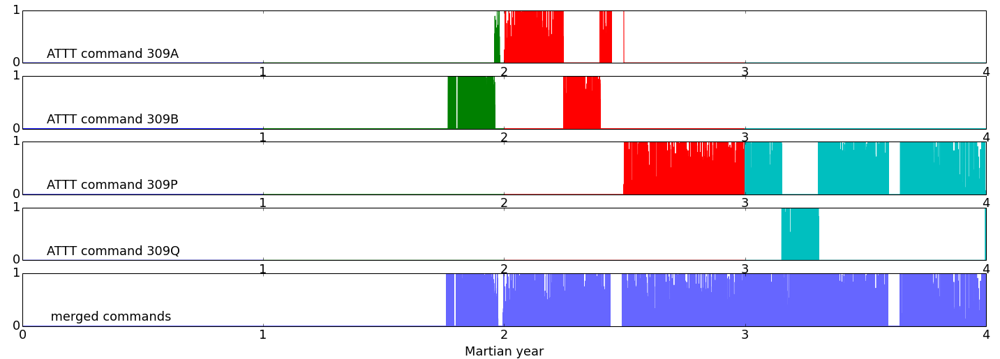
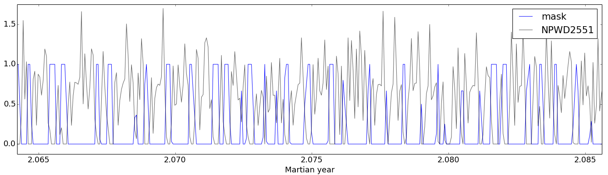
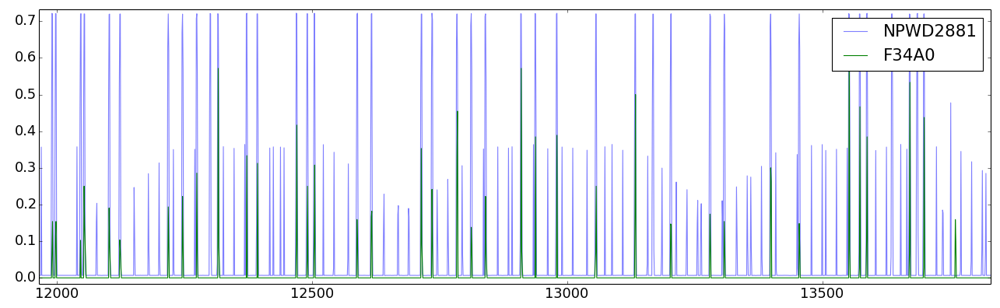
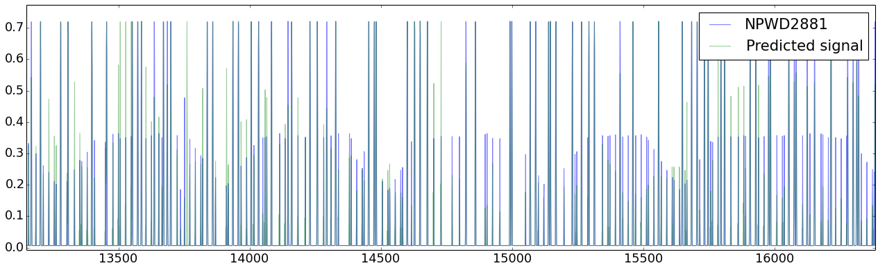
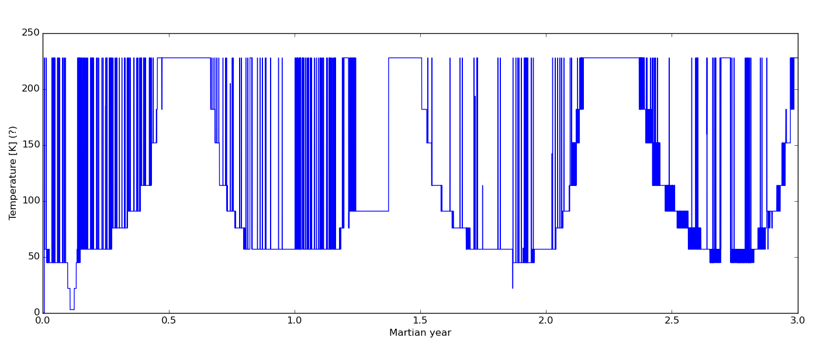

# Mars Express Power Challenge

Code and documentation for the 3rd place solution at the Mars Express Power Challenge 
hosted by the European Space Agency : https://kelvins.esa.int/mars-express-power-challenge/

**Authors**:
* [Rafal Cycon](https://www.linkedin.com/in/rafalcycon)
* [Krzysztof Kolasinski](https://www.youtube.com/watch?v=dQw4w9WgXcQ)
* [Wojciech Kryscinski](https://www.linkedin.com/in/wkryscinski)
* [Tomasz Zietek](https://linkedin.com/in/tomasz-zietek-5362a263)

**License** : BSD 3-clause. see License.txt

**Contents** :

1. [Description](#description)
2. [Features and preprocessing](#features-and-preprocessing)
    - [Overview](#overview)
    - [Discontinued commands](#discontinued-commands)
    - [Subsystem ATTT and NPWD2551](#subsystem-attt-and-npwd2551)
    - [Subsystem AOOO and NPWD2881](#subsystem-aooo-and-npwd2881)
    - [Subsystem ATMB](#subsystem-atmb)
3. [Creating predictions](#creating-predictions)
    - [Most important power lines](#most-important-power-lines)
    - [Xgboost](#xgboost)
    - [Neural networks](#neural-networks)
    - [Miscellaneous](#miscellaneous)
    - [Results](#results)
4. [Code](#code)
5. [Acknowledgements](#acknowledgements)

# Description

Since 2004 the [Mars Express Orbiter](https://en.wikipedia.org/wiki/Mars_Express)
has been gathering 3D imagery data about Mars that has helped to understand the 
planet's ionosphere and ground subsurface composition, as well as provide information 
that supports ground exploration missions on Mars and a lot of other research.

An autonomous thermal subsystem keeps the spacecraft within its operating temperature range.
Predictions of power consumption of each of 33 thermal power lines are used 
to provide safer flights with better plans for optimized science operations. However,
due to equipment wear off and other factors, the subsystem's behaviour changes in time
and current models were found to no longer be accurate enough.

Competitors were given data for 3 Martian years (that correspond to period 
22.08.2008-14.04.2014) that included context data (e.g. solar angles, logs of 
commands of different subsystems, logs of spacecraft's trajectory events)
and power consumption of 33 thermal power lines. 
They were then asked to predict thermal power consumption for the 4th Martian year 
(14.04.2014-01.03.2016), for which only the context data was given. 
Quality of predictions was measured with the Root Mean Square Error (RMSE).

# Features and preprocessing
## Overview
Features were extracted and engineered from all provided files, namely:

**Solar aspect angles (SAAF)**:
- solar angles: sa, sx, sy, sz
- cosines of solar angles
- density, i.e. number of measurements in 1s intervals 

**Events Files (EVTF)**:
- indicators for occultation and penumbra/umbra events
- indicator for current nadir pointing direction (N-to-S or S-to-N)
- indicator for current Earth pointing direction (N-to-S or S-to-N)
- MEX's current/last position above Mars reference ellipsoid
- MEX's trajectory direction (ascend/descend) w.r.t. the Mars reference ellipsoid

**Flight Dynamics TimeLine (FTL)**:
- indicators (one-hot encoding) of each event
- indicator of the communication device being used

**Detailed Mission Operations Plan (DMOP)**:
- indicator (one-hot encoding) of each command for each subsystem (i.e. last triggered command)
- amount of command changes in the last hour for each subsystem

**Long-term data (LTDATA)**:
- as is

Data was resampled to 1h intervals and missing values were linearly interpolated. 
Experiments were made with different interpolation strategies 
(e.g. linear interpolation for continues variables, padding for categorical ones),
but they yielded worse RMSE in local tests than simply using linear interpolation
in all features.

Two datasets were created:
- dataset1 (generated by prepare_data1.py): contains above features, in total 233 columns.
- dataset2 (generated by prepare_data2.py): does not contain any DMOP features, but contains 
summary statistics (mean, standard deviation) of past changes of features for
several intervals (e.g. 2/6/12/24 hours), as well as counts of
activity/changes in each provided file, in total 227 columns. 
Using this dataset helped bring down RMSE of NPWD2451 and NPWD2532.

It is worth noting that a lot more features (~500 more besides already mentioned ones) 
were generated along the way, e.g. minutes passed since last command change of 
subsystem ATTT, or derivatives of solar aspect angles, but using them led to poor
RMSE on the test set. We think that this is due to the system being very dynamic 
and most of states seem to have occurred just a few times at most, therefore high
dimensionality might have lead to overfitting.

## Discontinued commands
The DMOP file contains many commands that were working for only some period of 
time (eg. started being used at the later half of the 3rd Martian year). 
We "fixed" that by identifying very similarly used commands within same subsystems 
that operated at different times, and we joined them together (with a simple summation) 
into a single command/feature. 
This makes an assumption that these commands correspond to roughly the same 
operations of the spacecraft. However, if this assumption is true, then joining 
these commands together will reduce dimensionality and make the algorithm's learning
task easier, as it will be able to draw inference from continuous signals, thus leading
to a more stable model and better predictions. Our local tests have verified that
indeed merging commands together is beneficial. And perhaps most importantly, 
the procedure allows to make use of commands active exclusively during 
the 4th Martian year.


*Commands of the ATTT subsystem numbered as 309(A/B/P/Q) work only for a short 
period in different years - different colors on the first four plots denote different Martian years.
In that case one feature/command is created instead of four separate ones.*

We have merged a number of commands from different subsystems, but unfortunately 
the merging process has been done manually by visual inspection among available 
commands in each subsystem. Therefore, in some cases produced features could have 
been merged in a wrong manner, thus leading to worse predictions. Domain knowledge, or 
a more sophisticated (automated) approach, should be applied to more accurately
identify suitable commands for the merging process.
We found that comparing the histograms of distances between nearest command 
activations among pairs of DMOP signals would be a good way to look for 
similarities between subsystem commands, but due to the lack of time we have not
implemented this method.

## Subsystem ATTT and NPWD2551
It was found that a feature built from merged commands 305C, 305O, 305P, 306C
and 306P from ATTT subsystem (which was termed the "mask") is highly correlated 
with the 2551 power line. 
It determines where current in NPWD2551 is switched ON or OFF. 
Hence we have used this mask in a post-processing step to reduce RMSE of NPWD2551:

    Y_hat_NPWD2551 = Y_hat_NPWD2551 * (1 – ATTT_305C_305O_305P_306C_306P)

The application of the mask improved local RMSE (as measured on the 3rd Martian year), 
reducing it on power line 2551 by 5% (0.352->0.335), which in turn brought down 
total RMSE from 0.9 to 0.88.
However, for some reasons it did not improve the RMSE on the 4th Marian year, 
on both the public and private test sets.


*The picture shows the relation between the mask feature and 2551 power line 
at the beginning of the 3rd Martian year (years are enumerated from 0).*

## Subsystem AOOO and NPWD2881
In order to predict the 2881 line we have used its correlation with AOOO subsystem commands. 
To take into account possible delays between the power line and the subsystem 
commands (i.e. some of the AOOO commands are triggered just before or just after
the 2881 signal appearance and some of them overlap exactly with current spikes) we have
applied constant shift (in time domain) to each AOOO command such that the 
correlation between 2881 power line and given subsystem command was optimized. 
In the picture below we show an example fragment of NPWD2881 from 3rd Martian year 
with superimposed single F34A0 command from AOOO subsystem, which clearly shows 
that as the F34A0 command is turned on the high amplitude current (around 0.7) is induced. 


*Correlation between NPWD2881 and command F34A0 from the AOOO subsystem.*

In our model we use a subset of commands from AOOO subsystem to build a prediction 
for the 2881 power line. In the picture below we show an example prediction for the 
last part of the 3rd Martian year.


*Actual and predicted current. The model is based only on simple on/off commands
of the AOOO subsystem.*

Using only AOOO a linear regression obtains RMSE=0.053. For comparison, 
the simplest constant value prediction computed as a mean current
from previous Martian years gives RMSE ~0.13, and an xgboost model with all features
achieves RMSE of ~0.09. With AOOO commands feeded into xgboost we have obtained a 
RMSE of around 0.05. That model was used as a final prediction for the 4th Martian year.

## Subsystem ATMB
The ATMB subsystem takes on commands of the form *dddK*, where *d* is a digit. This fact, 
and also observing the commands' switching sequence, lead us to believe that 
these are actually temperature measures. Out of all commands of the ATBM subsystem
a single feature was created, called "ATMB_temp".

*Temperature (probably?) extracted from the ATMB subsystem.*

# Creating predictions

## Most important power lines
Varying accuracy of models between power lines, combined with different ranges of
currents each power line operates in, results in different weights each power line 
has on the total RMSE. Judging by local tests with xgboost it was established 
that a few lines correspond to 90% of total RMSE: 
NPWD2551 (49%), NPWD2451 (24%), NPWD2851 (12%), NPWD2532 (5%). Additional steps 
were taken (bagging, ensembling) when building predictions for these power lines.

## XGBoost
XGBoost models were used for all power lines (i.e. a separate model was trained for each of them), 
with default parameters, except for number of estimators which was raised to 200 
from default 100. Generated predictions were then clamped into min-max values specific
for each power line as estimated from the training data (this brought minor 
RMSE improvement on the order of 1e-5).

To improve accuracy on power lines most influential on the RMSE we bagged xgboost
by selecting a random subset of features for each bagged model, and for NPWD2551
we additionally randomly varied several learning parameters in each bagged model.

## Neural Networks
A variety of neural network models were created and tested with the goal to improve 
predictions on lines NPWD2451, NPWD2551 and NPWD2851. Different architectures were 
used in experiments, including classic ANNs, RNNs, and mixed models with both recurrent 
units and deep dense layers.

Before training neural models, values in the dataset were normalized and features 
with a standard deviation of 0 were removed. Additional transformations were applied 
to the data in order to conform with the required input format of recurrent models.

Through our experiments. we have found classic dense networks to outperform other 
neural models. Results generated with ANN models were more stable and performed
better in cross validation. Custom architectures were created for each output power line, 
and meaningful improvements were achieved for lines 2451 and 2851. 
These results were produced by a 6-layer network with the number of units 
increasing from 64 to 256 (for 2451) and a 3-layer network with 128 units per layer (for 2851). 
Both models used SReLU activation units and dropout between layers. In our experiments, 
we were unable to create a model that would improve the overall RMSE for power line 2551.

We have also spent a significant amount of time experimenting with recurrent networks, 
which by definition should be well suited for time related data. Both LSTM and GRU units 
were used in different configurations, including one-way and two-way networks with single 
and multiple recurrent layers. Our models performed best when they were given examples 
consisting of 10-15 data points from the past with a 6 hour gap between consecutive points. 
Unfortunately all these models gave very unstable results across experiments. 
Despite regularization, recurrent models overfitted the dataset and gave 
unsatisfactory results in cross validation.


## Miscellaneous
We have observed that data in the 1st Martian year differs significantly than in
subsequent years. Removing the entire 1st Martian year from the training data 
improved RMSE on the test set (i.e. public leaderboard) by ~1e-3.

In local tests in the case of several power lines it was more beneficial to 
subsitute a constant value as a prediction, as models' predictions generated
higher RMSE in these cases. 
Using a mean of current of previous years should best minimize RMSE, but yet we 
have found that subsituting a median lowers RMSE but a larger factor.

## Results

A final RMSE of 0.0819 (both on public and private test sets) was obtained by 
combining all the above steps:
- removing the 1st Martian year from the training data,
- training an xgboost model for each power line on dataset1, 
except for NPWD2451 and NPWD2532 which were trained on dataset2,
- bagging xgboost in NPWD2451, NPWD2532, NPWD2551 and NPWD2851,
- ensembling bagged xgboost with a neural network in NPWD2451 and NPWD2851, 
- exploiting relationship between subsystem AOOO and NPWD2881,
- substituting median current consumption in power lines for which xgboost gave 
unsatisfactory predictions.

Table below shows how bagging and ensembling reduced RMSE on most influential power lines.
Values in the table correspond to RMSE attained in local tests, in which 
models were tested on the 3rd Martian year.

| Method                           | NPWD2551 | NPWD2451 | NPWD2851 | NPWD2532 |
|----------------------------------|----------|----------|----------|----------|
| Weight in total RMSE             |   49%    |    24%   |    12%   |    5%    |
| Dataset used                     | Dataset1 | Dataset2 | Dataset1 | Dataset2 |
| Xgboost                          |  0.374   |  0.2679  |  0.1918**|  0.1184  |
| Xgboost bagged                   |  0.3516* |  0.2626  |  0.1918**|  0.1151  |
| Neural network                   |    -     |  0.267   |  0.1699  |     -    |
| Xgboost bagged + Neural network  |    -     |  0.2607  |  0.178** |     -    |

*For NPWD2551 several learning parameters of the xgboost algorithm were randomly 
selected in each bagged model, besides random sampling of features. 
This approach did not provide satisfactory scores in other power lines.

**Xgboost model for NPWD2851 produced highly inaccurate predictions when tested on the 3rd 
Martian year, whereas in cross validation and on the test set we found it to 
perform well enough to include it in the ensemble with the neural network.

# Code

Install dependencies:
- Python 2.7
- Numpy 1.11.0
- Pandas 0.18.0
- [XGBoost](https://github.com/dmlc/xgboost) 0.40
- Theano 0.8.2
- [Keras](https://github.com/fchollet/keras) 1.0.3

[Download the data](https://kelvins.esa.int/mars-express-power-challenge/data/),
unpack the files so that folders *train_set* and *test_set* reside in the root 
directory of the project. Move the *power-prediction-sample-2014-04-14_2016-03-01.csv*
file to the *test_set* folder.

Now you can regenerate the solution by running two bash scripts:

```
$ sh prepare_data.sh
$ sh create_submission.sh
```


# Acknowledgements
A special thanks to ESA for organizing this incredibly interesting challenge, 
and to [Redouane Boumghar](https://www.linkedin.com/in/boumghar) 
for his excellent maintenance of the competition.

Thank you also to [Alexander Bauer](https://www.linkedin.com/in/alexander-bauer-a5913615) 
for opensourcing a portion of his code early in the competition and
for sharing his cross-validation strategy.

And thank you to Alexander Bauer and [Keith Trnka](https://www.linkedin.com/in/keith-trnka-87044831) 
for being open about their approaches to the problem.
